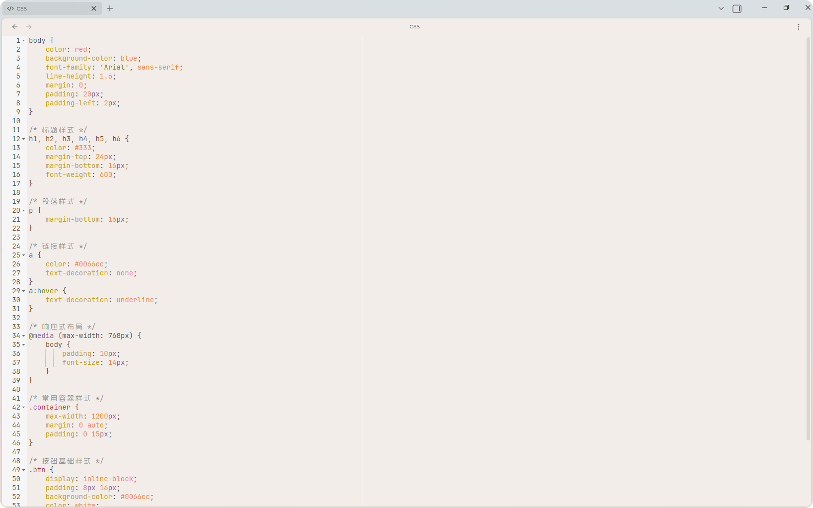
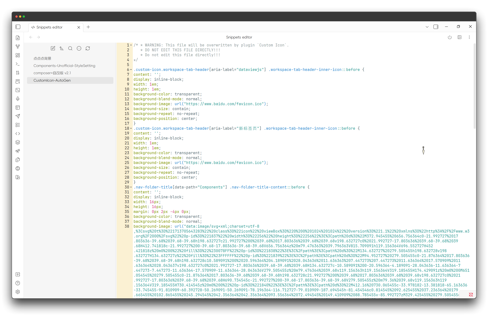
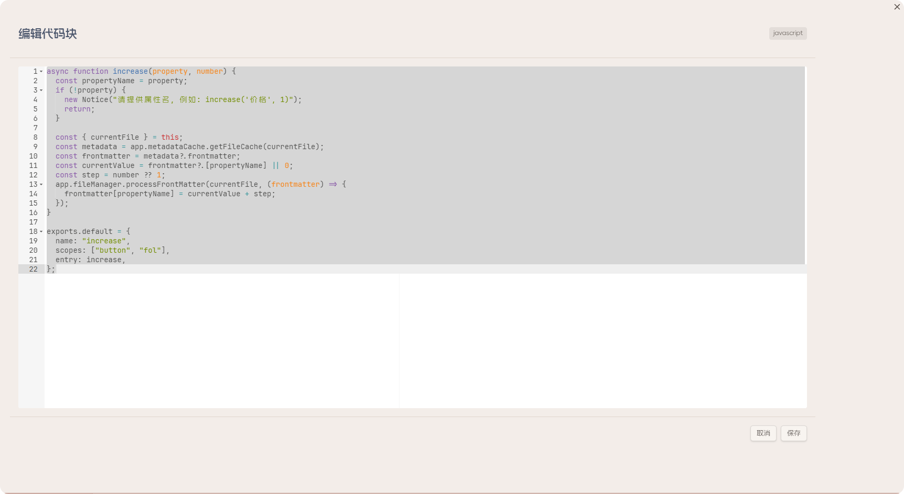
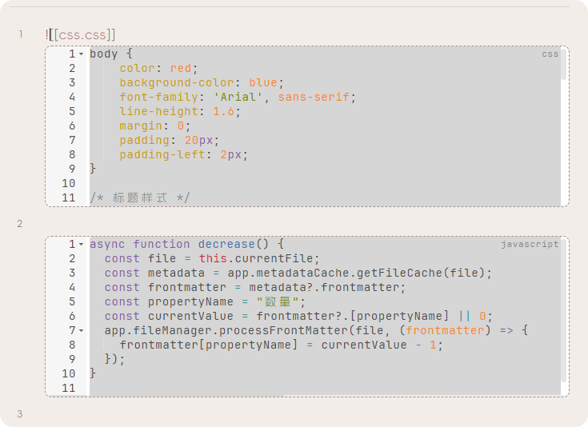

English | [中文](https://github.com/Raven-Pensieve/obsidian-ace-code-editor/blob/master/README-zh.md)

# ACE CODE EDITOR

An enhanced code editor using Ace editor, providing syntax highlighting, code folding, and other advanced editing features.

## Features

-   Edit code directly in Obsidian
    

-   Manage CSS snippets
    

-   Edit code blocks
    

-   Code file preview
    

## Installation
### Community plugin market installation

[Click to install](obsidian://show-plugin?id=ace-code-editor), or:

1. Open Obsidian and go to `Settings > Community Plugins`.
2. Search for "Ace Code Editor".
3. Click "Install".

### BRAT (Recommended for Beta Users)

1. Install [BRAT](https://github.com/TfTHacker/obsidian42-brat) plugin
2. Click "Add Beta plugin" in BRAT settings
3. Enter `Raven-Pensieve/obsidian-ace-code-editor`
4. Enable the plugin

## License

This project is licensed under the MIT LICENSE - see the [LICENSE](LICENSE) file for details.

## Star History

